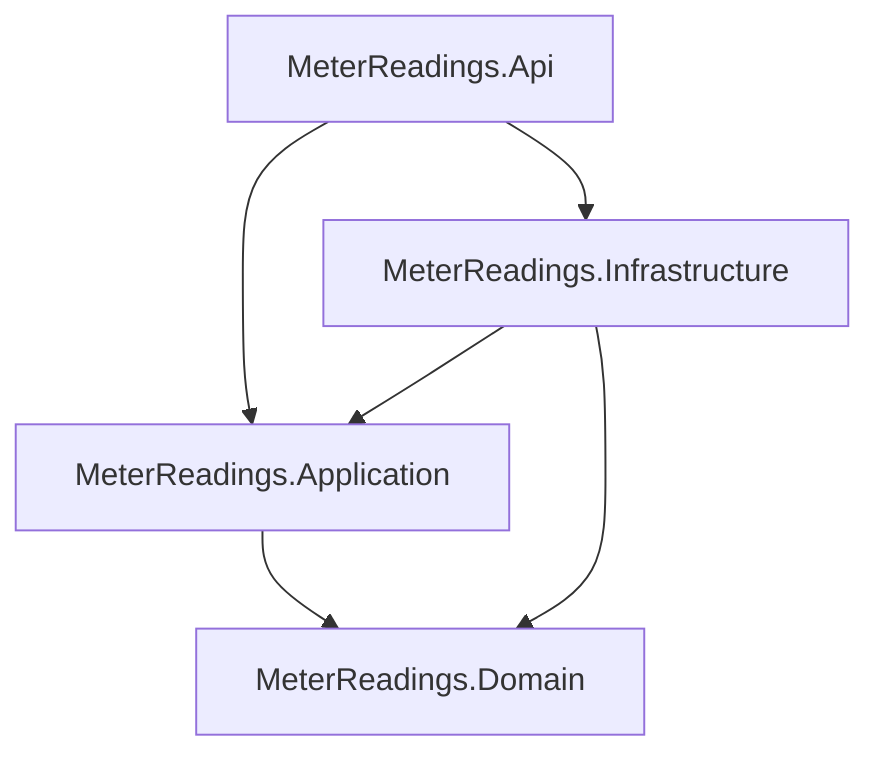
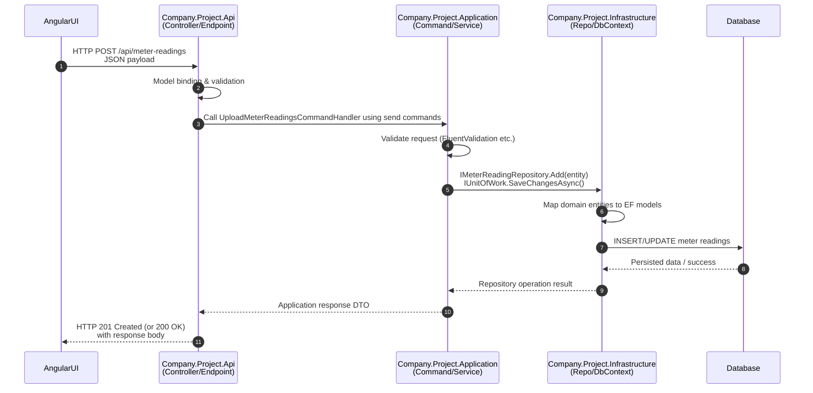

# ENSEK Meter Readings Assignment (Clean Architecture, Config-driven URLs, MediatR)

> Parts of this project (project scaffolding and some boilerplate code) were generated with the help of an AI coding assistant.  
> I have reviewed, understood and adapted the code to ensure it meets the assignment requirements and my own coding standards.

## Projects Dependency Diagram





Textual dependency view:

```text
Company.Project.Api
  ├─> Company.Project.Application
  │     └─> Company.Project.Data
  └─> Company.Project.Infrastructure
        ├─> Company.Project.Application
        │     └─> Company.Project.Data
        └─> Company.Project.Data
```

## Backend projects

- `src/Company.Project.Api` – ASP.NET Core Web API  
  - CORS & Swagger configured via `appsettings.json` (no hard-coded URLs in `Program.cs`)  
  - Controllers use MediatR commands/queries that live in the Application project
- `src/Company.Project.Application` – application services & business rules, MediatR commands/queries/handlers
- `src/Company.Project.Infrastructure` – EF Core + SQLite, repositories, CSV parsing, seeding
- `src/Company.Project.Data` – core domain entities and value objects

## Frontend

- `src/ensek-meter-readings-ui` – Angular UI (`environment.ts` / `environment.prod.ts` hold the API base URL)

## Tests

- `tests/Company.Project.Application.Tests` – xUnit + FluentAssertions tests for the upload logic

## Key libraries & patterns

- MediatR **12.1.1** – CQRS-style commands and queries (e.g. `UploadMeterReadingsCommand`, `GetAllAccountsQuery`)
- Microsoft.EntityFramework **10.0.0**
- Moq
- CORS & Swagger configuration via `appsettings.json` (no hard-coded URLs in `Program.cs`)
- Clean separation of concerns across **Domain / Application / Infrastructure / Api**

## Run API (no Docker)

```bash
# Change DefaultConnection in src/Company.Project.Api/appsettings.json to point to your DB server
cd src/Company.Project.Api
dotnet restore
dotnet run
```

Swagger UI: available at `/swagger` on the printed port.

## Run UI (no Docker)

```bash
cd ui/ensek-meter-readings-ui
npm install
npm start
```

## Run with Docker

```bash
# From the root folder where docker-compose.yml lives
docker compose build
docker compose up
```

- API: http://localhost:8080  
- UI:  http://localhost:4200
